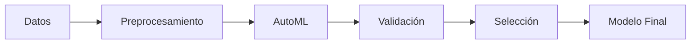
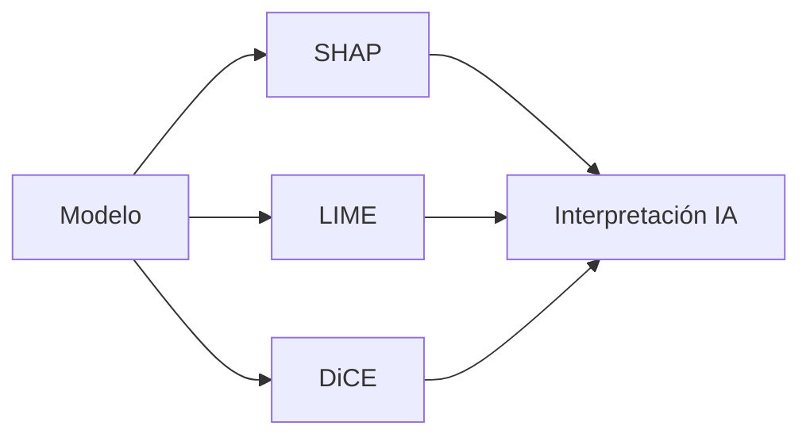
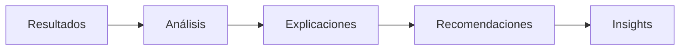
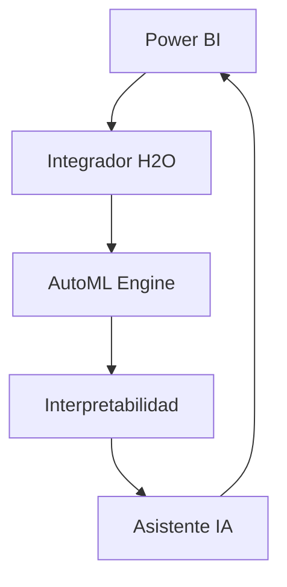

# Introducción a H2O AutoML con IA Interpretable

## Visión General
Este sistema integra H2O AutoML con Power BI, proporcionando capacidades avanzadas de machine learning automatizado con interpretabilidad asistida por IA.

## Características Principales

### 🤖 AutoML Avanzado
- Selección automática de algoritmos
- Optimización de hiperparámetros
- Validación cruzada automática
- Ensamble de modelos
- Early stopping inteligente

### 🔍 Interpretabilidad Mejorada
- SHAP (SHapley Additive exPlanations)
- LIME (Local Interpretable Model-agnostic Explanations)
- Counterfactuals con DiCE
- Análisis de interacciones
- Visualizaciones interactivas

### 🧠 Asistente IA
- Interpretación automática de resultados
- Recomendaciones técnicas basadas en IA
- Explicaciones en lenguaje natural
- Insights accionables

### 📊 Integración Power BI
- Conexión directa
- Visualizaciones automáticas
- Actualización en tiempo real
- Explicaciones integradas

## Componentes del Sistema

### 1. Motor AutoML

### 2. Capa de Interpretabilidad

### 3. Asistente IA

## Beneficios

### 1. Automatización
- Reducción de tiempo de desarrollo
- Optimización automática
- Validación sistemática
- Mantenimiento simplificado

### 2. Interpretabilidad
- Decisiones transparentes
- Insights accionables
- Confianza en predicciones
- Explicaciones claras

### 3. Productividad
- Flujo de trabajo optimizado
- Integración seamless
- Actualización automática
- Monitoreo continuo

## Casos de Uso

### 1. Análisis Predictivo
- Predicción de ventas
- Forecast de demanda
- Análisis de tendencias
- Detección de anomalías

### 2. Clasificación
- Segmentación de clientes
- Detección de fraude
- Análisis de riesgo
- Categorización automática

### 3. Optimización
- Pricing dinámico
- Optimización de inventario
- Asignación de recursos
- Planificación de capacidad

## Arquitectura

## Próximos Pasos
1. [Instalación](02-instalacion.md)
2. [Primeros Pasos](03-primeros-pasos.md)
3. [Flujo de Trabajo](04-flujo-trabajo.md) 