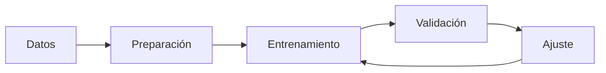
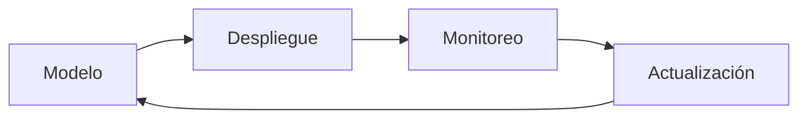

# 🔄 Flujo de Trabajo

## 🎯 Ciclo de Vida del Modelo

### 1. Desarrollo


### 2. Producción


## 📊 Gestión de Datos

### Fuentes de Datos
- Bases de datos SQL
- Archivos CSV/Excel
- APIs externas
- Power BI datasets

### Preparación
```python
from src.IntegradorH2O_PBI import H2OModeloAvanzado

# Inicializar
modelo = H2OModeloAvanzado()

# Preparar datos
datos_prep = modelo.preparar_datos(
    datos,
    objetivo='target',
    categoricas=['cat1', 'cat2'],
    numericas=['num1', 'num2'],
    fecha='fecha'
)
```

## 🔄 Entrenamiento y Validación

### Proceso de Entrenamiento
```python
# Configuración
config = {
    'max_models': 20,
    'max_runtime_secs': 300
}

# Entrenamiento
resultado = modelo.entrenar(
    datos_prep,
    **config
)
```

### Validación Cruzada
```python
# Validación
metricas = modelo.validar_cruzado(
    datos_prep,
    k_folds=5
)
```

## 🚀 Despliegue y Monitoreo

### Proceso de Despliegue
1. Exportar modelo
2. Configurar ambiente
3. Verificar dependencias
4. Probar integración

### Monitoreo Continuo
```python
# Monitoreo de rendimiento
monitor = modelo.monitorear_rendimiento()

# Alertas
if monitor['drift_detectado']:
    modelo.notificar_alerta('drift_detectado')
``` 